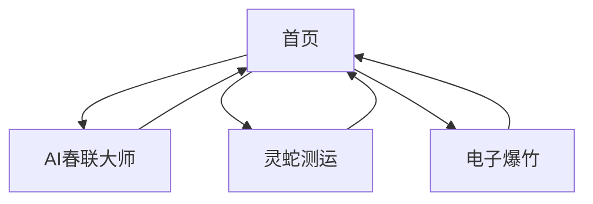

## 1. 产品概述
AI年味是一个将传统中国年俗与现代AI技术相结合的网页应用。用户可以通过AI生成个性化春联、抽取新年运势、体验环保电子爆竹，让千年年俗在数字时代焕发新活力。
- 目标用户：对中国传统文化感兴趣的年轻人、科技爱好者、海外华人
- 市场价值：传播中华年俗文化，展示AI技术在日常生活中的创意应用

## 2. 核心功能

### 2.1 用户角色
本应用为开放式体验，无需用户注册即可使用所有功能。

### 2.2 功能模块
AI年味应用包含以下核心页面：
1. **首页**：应用介绍、功能导航、节日氛围营造
2. **AI春联大师**：主题输入、对联生成、结果展示
3. **灵蛇测运**：抽卡界面、运势解读、分享功能
4. **电子爆竹**：点击交互、动画效果、音效播放

### 2.3 页面详情
| 页面名称 | 模块名称 | 功能描述 |
|---------|---------|---------|
| 首页 | 欢迎区域 | 展示应用标题和简介，营造春节氛围 |
| 首页 | 功能导航 | 三个核心功能的入口按钮，配有图标和简介 |
| 首页 | 背景装饰 | 动态春节元素，如飘落的花瓣或灯笼 |
| AI春联大师 | 输入区域 | 用户输入主题关键词（如"程序员"、"健康"） |
| AI春联大师 | 生成按钮 | 触发AI生成对联的交互按钮 |
| AI春联大师 | 结果展示 | 显示生成的上联、下联和横批，支持复制 |
| AI春联大师 | 重新生成 | 用户可重新输入主题生成新对联 |
| 灵蛇测运 | 抽卡区域 | 显示背面朝上的运势卡片，点击翻转 |
| 灵蛇测运 | 运势解读 | AI生成的个性化新年祝福和运势说明 |
| 灵蛇测运 | 分享按钮 | 支持将运势结果分享到社交媒体 |
| 电子爆竹 | 爆竹展示 | 显示传统爆竹图像或3D模型 |
| 电子爆竹 | 点击交互 | 用户点击触发爆炸动画和音效 |
| 电子爆竹 | 连放模式 | 支持连续点击产生多重爆竹效果 |

## 3. 核心流程
用户访问流程：
1. 用户进入首页，浏览应用介绍
2. 选择感兴趣的功能模块：AI春联、灵蛇测运或电子爆竹
3. 在AI春联页面输入主题，获取个性化对联
4. 在灵蛇测运页面抽取新年运势卡片
5. 在电子爆竹页面体验环保爆竹效果
6. 用户可重复体验各个功能或分享给朋友

## 4. 用户界面设计

### 4.1 设计风格
- **主色调**：中国红 (#DC2626) 配金色 (#F59E0B) 装饰
- **辅助色**：深红 (#991B1B)、暖金 (#FCD34D)
- **按钮样式**：圆角矩形，悬停时有金色光晕效果
- **字体**：标题使用思源黑体，正文使用系统默认字体
- **布局风格**：卡片式布局，居中对称，符合传统美学
- **图标风格**：使用Lucide React图标库，线条简洁现代

### 4.2 页面设计概览
| 页面名称 | 模块名称 | UI元素 |
|---------|---------|---------|
| 首页 | 欢迎区域 | 大标题使用金色渐变文字，背景为淡红色，配有祥云纹样 |
| 首页 | 功能导航 | 三个圆形按钮，红底金字，悬停时有旋转动画 |
| AI春联大师 | 输入区域 | 白色输入框，红色边框，占位符文字为金色 |
| AI春联大师 | 结果展示 | 仿宣纸背景，黑色书法字体，横批居中显示 |
| 灵蛇测运 | 抽卡区域 | 3D翻转卡片效果，背面为蛇年图案，正面为运势内容 |
| 电子爆竹 | 爆竹展示 | 红色爆竹3D模型，点击后产生粒子爆炸效果 |

### 4.3 响应式设计
- 桌面端优先设计，最大宽度1200px
- 平板端自适应，保持核心功能完整
- 移动端优化，触摸交互友好，字体适当放大
- 支持横竖屏切换，布局自动调整