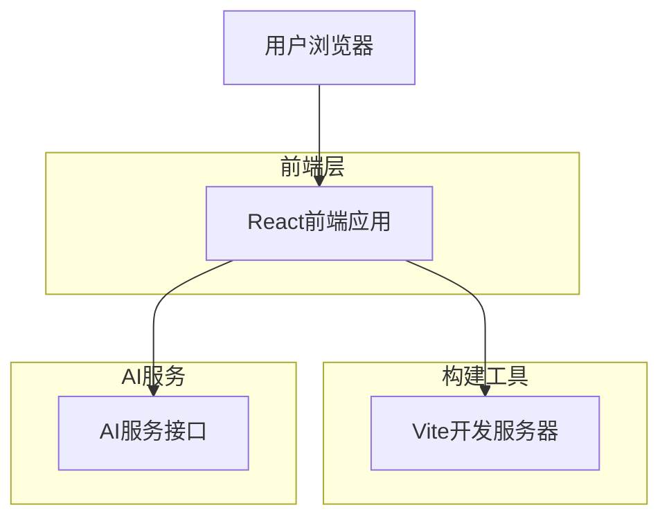
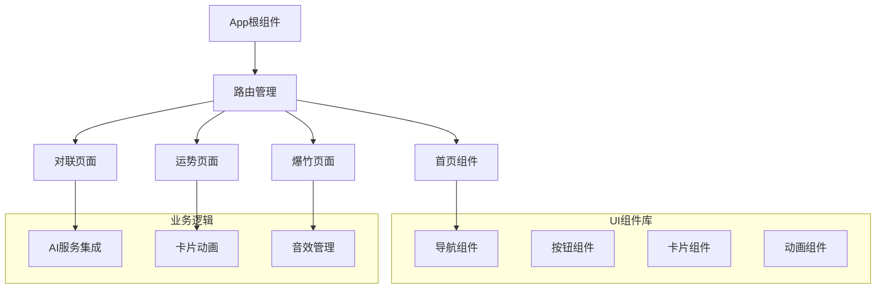

## 1. 架构设计



## 2. 技术栈描述

- **前端框架**：React@18 + TypeScript
- **构建工具**：Vite@5（vite-init初始化）
- **样式框架**：TailwindCSS@3
- **图标库**：Lucide React
- **动画库**：Framer Motion（用于3D效果和过渡动画）
- **AI集成**：OpenAI API（用于对联生成和运势解读）
- **音频处理**：Web Audio API（用于爆竹音效）
- **状态管理**：React Context + useReducer

## 3. 路由定义

| 路由路径 | 页面用途 |
|---------|---------|
| / | 首页，应用介绍和功能导航 |
| /couplet | AI春联大师页面，生成个性化对联 |
| /fortune | 灵蛇测运页面，抽取新年运势 |
| /firecrackers | 电子爆竹页面，体验环保爆竹效果 |

## 4. 核心组件结构

### 4.1 主要组件
```typescript
// 核心页面组件
interface HomePageProps {
  onNavigate: (path: string) => void;
}

interface CoupletPageProps {
  onBack: () => void;
}

interface FortunePageProps {
  onBack: () => void;
}

interface FirecrackersPageProps {
  onBack: () => void;
}
```

### 4.2 AI服务接口
```typescript
// 对联生成请求
interface CoupletRequest {
  theme: string;
  style?: 'traditional' | 'modern' | 'humorous';
}

// 对联生成响应
interface CoupletResponse {
  upper: string;    // 上联
  lower: string;    // 下联
  horizontal: string; // 横批
  explanation?: string; // 解释说明
}

// 运势卡片类型
interface FortuneCard {
  id: string;
  title: string;
  content: string;
  blessing: string;
  type: 'career' | 'love' | 'health' | 'wealth';
}
```

## 5. 前端架构设计



## 6. 数据模型

### 6.1 本地状态管理
```typescript
// 应用状态接口
interface AppState {
  currentPage: 'home' | 'couplet' | 'fortune' | 'firecrackers';
  coupletHistory: CoupletResponse[];
  fortuneHistory: FortuneCard[];
  settings: {
    soundEnabled: boolean;
    animationEnabled: boolean;
  };
}

// 动作类型
type AppAction = 
  | { type: 'NAVIGATE'; payload: string }
  | { type: 'SAVE_COUPLET'; payload: CoupletResponse }
  | { type: 'SAVE_FORTUNE'; payload: FortuneCard }
  | { type: 'TOGGLE_SOUND' }
  | { type: 'TOGGLE_ANIMATION' };
```

### 6.2 音频资源管理
```typescript
// 音效配置
interface AudioConfig {
  firecracker: {
    url: string;
    volume: number;
    preload: boolean;
  };
  background: {
    url: string;
    volume: number;
    loop: boolean;
  };
}
```

## 7. 性能优化策略

- **代码分割**：按路由懒加载组件
- **图片优化**：使用WebP格式，支持响应式图片
- **音频优化**：预加载关键音效，使用WebM格式
- **动画优化**：使用CSS3硬件加速，避免重排重绘
- **缓存策略**：本地存储用户生成的对联和运势记录