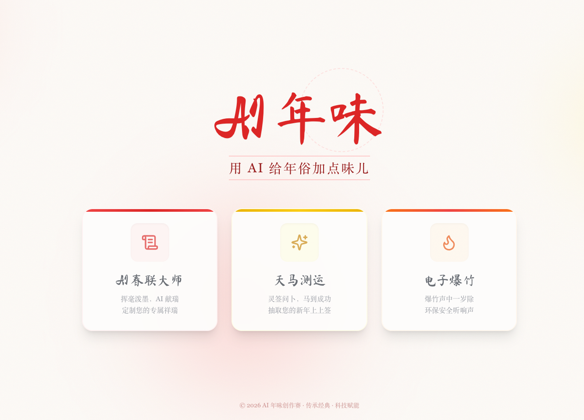
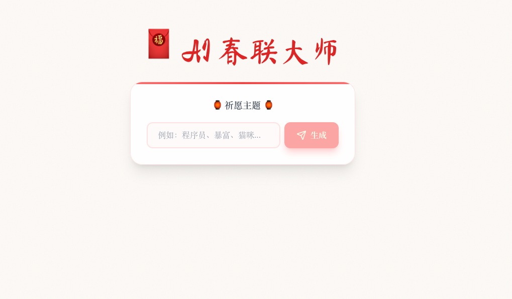
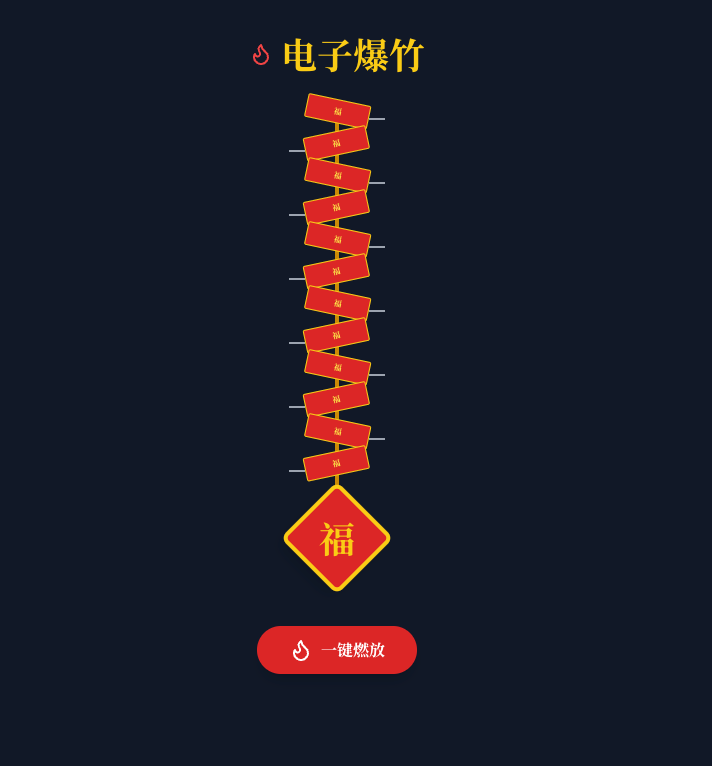

# AI 年味 (AI New Year Flavor) 🧧✨

> 🏆 本项目旨在参加 **Trae Friends 首期挑战赛 ·「AI 年味创作赛」** (创意赛道)
>
> 用代码复活传统年俗，让 AI 更有年味儿！

[](https://vercel.com/new/clone?repository-url=https%3A%2F%2Fgithub.com%2Flizhe-0423%2Fai-new-year)

**AI 年味** 是一个结合了传统中国年俗与现代 AI 技术的创意网页应用。在这个 2026 马年春节，我们用赛博朋克风格重塑了写春联、求运势、放爆竹等经典习俗，为您带来一场别样的“数字庙会”。

## 📸 项目截图

### 首页 - 赛博中国风


### 🧧 AI 春联大师
> 输入您的新年愿望（如“程序员”、“暴富”），AI 即刻为您挥毫泼墨，生成对仗工整的专属春联。
> 


### 🐴 天马测运 (马年限定)
> 诚心祈福，抽取您的 2026 丙午马年运势卡。包含八卦卦象、古风签文及 AI 深度解签。
> 


### 🧨 电子爆竹
> 环保又热闹！点击屏幕燃放电子爆竹，感受震动反馈与真实音效，驱散年兽，迎来好运。
> 


---

## 🛠️ 技术栈

*   **前端框架**: React 18 + TypeScript
*   **构建工具**: Vite 6
*   **样式方案**: Tailwind CSS (赛博中国风配色 + 玻璃拟态)
*   **动画引擎**: Framer Motion (流畅的卡片翻转与入场动画)
*   **AI 服务**: OpenAI API (兼容 DeepSeek V3)
*   **后端服务**: Node.js / Vercel Serverless Functions (保护 API Key 安全)
*   **部署**: Vercel

## 🚀 快速开始

### 1. 克隆项目

```bash
git clone https://github.com/lizhe-0423/ai-new-year.git
cd ai-new-year
```

### 2. 安装依赖

```bash
npm install
```

### 3. 配置环境变量

在项目根目录创建 `.env` 文件，并添加以下配置：

```env
# 您的 OpenAI 或 DeepSeek API Key
OPENAI_API_KEY=sk-xxxxxxxxxxxxxxxxxxxxxxxx

# API Base URL (例如使用 DeepSeek)
OPENAI_BASE_URL=https://api.deepseek.com

# 使用的模型名称
AI_MODEL=deepseek-chat
```

### 4. 启动开发服务器

我们需要同时启动后端 API 服务（用于转发 AI 请求）和前端界面：

**终端 1 (启动后端):**
```bash
npm run server
```

**终端 2 (启动前端):**
```bash
npm run dev
```

现在，打开浏览器访问 `http://localhost:5173` 即可体验！

## 📦 部署 (Vercel)

本项目已针对 Vercel 进行了优化，支持一键部署。

1.  将代码推送到 GitHub。
2.  在 Vercel 中导入项目。
3.  在 Vercel 的 **Environment Variables** 设置中添加 `OPENAI_API_KEY`、`OPENAI_BASE_URL` 和 `AI_MODEL`。
4.  点击 Deploy，Vercel 会自动识别 `api/` 目录并部署为 Serverless Functions。

## 📄 许可证

MIT License © 2026 AI 年味创作组
